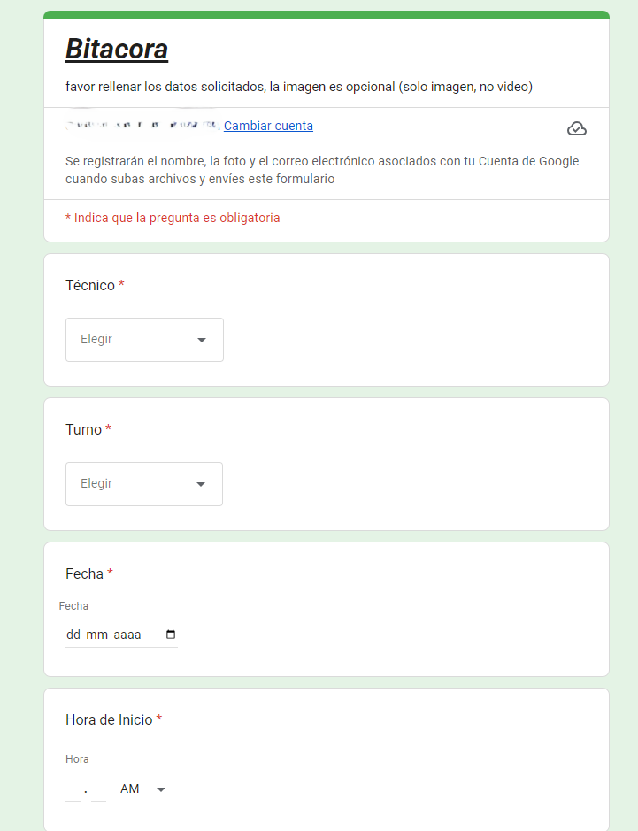

# 📋 Sistema de Bitácora Digital — Área de Mantención

> **Proyecto personal implementado en entorno real de trabajo**  
> Empresa de logística y distribución nacional | Área de Mantención Industrial  
> **+2.200 registros reales capturados desde su implementación**

---

## 🧩 Problema que resolvía

El área de mantención no contaba con un sistema eficiente para registrar las actividades diarias del equipo técnico. El proceso anterior era:

- Cada técnico ingresaba manualmente sus registros del día en una tabla Excel en un computador compartido
- Luego enviaba esa tabla por correo electrónico a la jefatura, todos los días
- El proceso era lento, tedioso y propenso a errores u omisiones
- La jefatura no tenía visibilidad en tiempo real de lo que ocurría en terreno

---

## 💡 Solución implementada

Diseñé e implementé un sistema digital de captura de información operacional usando **Google Forms + Google Sheets**, distribuido al equipo de 11 técnicos a través del grupo de WhatsApp del área.

### Flujo del sistema

```
Técnico (celular con cuenta Google activa)
       │
       │  Autenticación requerida: Google Account
       ▼
  Google Forms  ◄── Link en descripción del grupo WhatsApp
       │
       │  Envío automático al completar cada registro
       ▼
  Google Sheets ◄── Base de datos en tiempo real (+2.200 registros)
       │
       ├── Jefatura revisa actividad diaria
       ├── Dashboard de análisis con gráficos integrados
       └── Reporte semanal (imágenes con gráficos enviadas al grupo)
```

> **Nota técnica:** El formulario requiere que cada técnico esté autenticado con su cuenta de Google para poder enviar registros. Esto garantiza trazabilidad de identidad por envío y evita registros anónimos.

---

## 📝 Datos capturados por registro

| Campo | Tipo | Descripción |
|---|---|---|
| Marca temporal | Automático | Fecha y hora exacta del envío del formulario |
| Técnico | Lista desplegable | Nombre del técnico que realiza el trabajo |
| Turno | Lista desplegable | Mañana / Tarde / Noche / Intermedio |
| Fecha | Calendario | Fecha de la actividad |
| Hora de inicio | Hora | HH:MM de inicio del trabajo |
| Hora de término | Hora | HH:MM de término del trabajo |
| Ubicación | Lista desplegable | Edificio o máquina (ej: Expressorter, Hub Principal, Exterior) |
| Tipo de trabajo | Lista desplegable | Eléctrico / Mantención Correctiva / Preventiva / Informe o Check-List / Monitoreo / Servicios Generales / otros |
| Detalles del trabajo | Texto libre | Descripción con las palabras del técnico |
| Repuestos utilizados | Texto libre | Materiales y repuestos ocupados |
| Técnicos participantes | Selección múltiple | Registro de colaboración entre técnicos |
| Fotografías | Archivo (x2) | Evidencia visual del trabajo realizado (opcional) |

---

## 📊 Impacto y resultados

Desde su implementación, el sistema acumula **más de 2.200 registros reales** de actividad técnica, lo que permite:

- **Eliminación del proceso manual** de Excel compartido + envío diario por correo
- **Trazabilidad completa** de cada actividad por técnico, turno, fecha y ubicación
- **Medición de productividad** diaria, semanal y mensual por individuo y equipo
- **Registro de colaboración** entre técnicos en trabajos de mayor complejidad
- **Historial de repuestos** para proyectar necesidades de inventario
- **Evidencia fotográfica** de trabajos realizados
- **Retroalimentación diaria** de la jefatura basada en datos reales
- **Reportes semanales** con gráficos de distribución por técnico, turno, ubicación y tipo de trabajo

---

## 📈 Vista del dashboard de respuestas

El sistema genera automáticamente visualizaciones de datos incluyendo:
- Distribución de actividades por técnico
- Actividad por turno (mañana / tarde / noche / intermedio)
- Actividad por ubicación (Expressorter, Hub Principal, Exterior, etc.)
- Distribución por tipo de trabajo
- Participación colaborativa entre técnicos

---

## 🔄 Comparativa antes / después

| Aspecto | Antes | Después |
|---|---|---|
| Método de registro | Excel manual en PC compartido | Formulario móvil desde celular |
| Distribución | Envío por correo diario | Automático al enviar |
| Tiempo de registro | Lento, acumulado al final del turno | Inmediato al terminar cada trabajo |
| Visibilidad jefatura | Diferida (fin del día) | Tiempo real |
| Riesgo de pérdida | Alto (archivo local) | Bajo (nube Google Drive) |
| Trazabilidad | Ninguna | Marca temporal por envío + cuenta Google |
| Datos históricos | Difíciles de analizar | Dashboard con gráficos automáticos |

---

## 🛠️ Tecnologías utilizadas

- **Google Forms** — Captura de datos móvil con autenticación Google
- **Google Sheets** — Almacenamiento y base de datos en tiempo real
- **Google Forms Dashboard** — Visualización y métricas integradas automáticas
- **WhatsApp** — Canal de distribución del acceso al sistema

---

## 🔒 Análisis de seguridad del sistema

Como parte de mi formación en ciberseguridad, identifiqué las siguientes fortalezas y vulnerabilidades del sistema:

### ✅ Controles existentes
- Autenticación obligatoria con cuenta Google para enviar registros
- Datos almacenados en la nube con respaldo automático de Google
- Marca temporal automática por cada envío (trazabilidad básica)
- Acceso a la hoja de respuestas restringido al propietario

### ⚠️ Vulnerabilidades identificadas
1. **Suplantación de identidad** — Un técnico podría seleccionar el nombre de otro en la lista desplegable. La cuenta Google autentica al remitente, pero el nombre en el formulario no está vinculado a ella.
2. **Control de acceso al link** — Cualquier persona con el link del grupo de WhatsApp podría acceder al formulario si tiene una cuenta Google.
3. **Auditoría de modificaciones** — Google Sheets no registra el historial de quién modificó celdas individuales en la hoja de respuestas.
4. **Sin política formal de respaldo externo** — El sistema depende completamente de la disponibilidad del servicio de Google.
5. **Gestión de accesos sin roles** — No existe control diferenciado de permisos entre jefatura, técnicos y administración del sistema.

### 🔧 Mejoras propuestas (trabajo futuro)
- Vincular el campo "Técnico" a la cuenta Google autenticada mediante Google Apps Script
- Implementar validación de dominio para restringir el acceso a cuentas corporativas
- Habilitar el historial de versiones de la hoja para auditoría de cambios
- Definir una política de retención y respaldo de datos

> *Este análisis fue desarrollado como parte de mi formación en Técnico en Ciberseguridad (Instituto Profesional San Sebastián, en curso desde marzo 2026).*

---

## 📸 Capturas del sistema

### Formulario de ingreso (vista técnico)


---

## 👤 Autor

**Cristian Flores Vera**  
Técnico Eléctrico de Mantención → Técnico en Ciberseguridad (en formación)  
📍 Santiago, Chile  
🔗 [linkedin.com/in/cristianfloresvera](https://linkedin.com/in/cristianfloresvera)  
🎓 CISCO Networking Academy | Instituto Profesional San Sebastián

---

*Sistema diseñado e implementado íntegramente por el autor en su entorno laboral real, sin presupuesto adicional, usando herramientas gratuitas de Google Workspace. Actualmente en uso activo con más de 2.200 registros capturados.*
